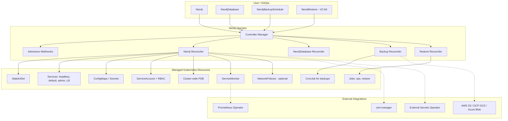

# Neo4j Kubernetes Operator — Full Proposal

Comprehensive operator design derived from analysis of the [Neo4j Helm charts](https://github.com/neo4j/helm-charts) repository. Covers vision, architecture, CRDs (V1 and V2), security, user experience, operational workflows, implementation phasing, and migration from Helm.

**Status**: draft  
**Date**: 2026-06-22  
**Related**: [BDR-001](adr/business/001-single-neo4j-crd.md) · [BDR-002](adr/business/002-neo4j-crd-topology.md) · [`00-vision.md`](00-vision.md) · [`09-crd-spec/readme.md`](09-crd-spec/readme.md)

---

## Table of contents

1. [Vision and design principles](#1-vision-and-design-principles)
2. [High-level architecture](#2-high-level-architecture)
3. [Custom resource definitions (CRDs)](#3-custom-resource-definitions-crds)
4. [Security model (cloud-ready)](#4-security-model-cloud-ready)
5. [User experience — easy to use](#5-user-experience--easy-to-use)
6. [Operational workflows (step by step)](#6-operational-workflows-step-by-step)
7. [V1 vs V2 scope summary](#7-v1-vs-v2-scope-summary)
8. [Reuse from Helm charts](#8-reuse-from-helm-charts)
9. [Recommended implementation order](#9-recommended-implementation-order)
10. [Migration path from Helm](#10-migration-path-from-helm)
11. [Open decisions to resolve before coding](#11-open-decisions-to-resolve-before-coding)

---

## 1. Vision and design principles

### What the operator replaces

| Today (Helm) | With Operator |
|---|---|
| N `helm install` for an N-node cluster | One `Neo4j` resource |
| Manual `ENABLE SERVER` via operations Job | Automatic cluster membership reconciliation |
| Per-release PDB (does not protect the cluster) | Cluster-wide PDB generated automatically |
| Shared LoadBalancer + pre-delete cleanup hook | Operator-owned shared services |
| Separate `neo4j-admin` chart + manual endpoint wiring | `Neo4jBackupSchedule` auto-targets the cluster |
| ~780-line `values.yaml` with interdependent validations | Small, opinionated spec with sensible defaults |
| `disableLookups: true` for GitOps/ArgoCD | No template-time cluster lookups |
| Manual restore / seedURI / maintenance mode toggling | Declarative restore workflow (V2 full, V1 basic) |

### Design principles

1. **One cluster, one API object** — users think in terms of “my Neo4j deployment,” not “3 StatefulSets + 1 headless service + 1 LB + 1 backup CronJob.”
2. **Secure by default** — restricted pod security, non-root, TLS encouraged, cloud IAM over static keys, NetworkPolicies optional but documented.
3. **Cloud-native** — first-class support for AWS (IRSA), GCP (Workload Identity), Azure (Workload Identity / managed identity), and cert-manager.
4. **Progressive disclosure** — simple spec for dev (`persistence.data.size: 10Gi`, `topology.mode: Standalone`); advanced knobs available but not required.
5. **Observable** — rich `.status`, Kubernetes events, Prometheus metrics, clear conditions.
6. **GitOps-friendly** — no Helm lookups, deterministic reconciliation, status-only drift detection.

### Alignment with existing ADRs

This proposal aligns with decisions already captured in the design package:

- **[BDR-001](adr/business/001-single-neo4j-crd.md)** — single `Neo4j` CRD with `spec.topology.mode: Standalone | Cluster` (not separate `Neo4jStandalone` / `Neo4jCluster` kinds).
- **[BDR-002](adr/business/002-neo4j-crd-topology.md)** — topology expressed as `mode` + `cores.members` + `readReplicas.members` (not flat member count).
- **[`09-crd-spec/readme.md`](09-crd-spec/readme.md)** — infra concerns (persistence, connectivity, trust, config) are embedded `spec` sections on `Neo4j`, not separate CRDs.

---

## 2. High-level architecture

### Architecture diagram



### Operator components

| Component | Role |
|---|---|
| **Controller Manager** | Runs all reconcilers; leader-elected for HA |
| **Neo4j reconciler** | Core lifecycle: create/update/scale/upgrade/delete deployment |
| **Neo4jDatabase reconciler** | Logical database management inside a `Neo4j` deployment |
| **Neo4jBackup / Neo4jBackupSchedule reconciler** | Manages backup Jobs and CronJobs, credentials, targeting |
| **Neo4jRestore reconciler** | One-shot restore / seed workflows |
| **Validating webhook** | Rejects invalid specs (edition vs topology, storage, TLS) |
| **Mutating webhook** | Defaults (resources, probes, securityContext, labels) |
| **Status updater** | Conditions, member health, endpoints, backup state |
| **Cluster membership manager** | Replaces the Helm operations Job (`ENABLE SERVER` / decommission) |
| **Upgrade orchestrator** | Ordered rolling upgrades with pre-checks |
| **CLI plugin** (`kubectl-neo4j`) | Optional: `kubectl neo4j status`, `neo4j backup trigger`, `neo4j connect` |

### Internal code layers

Per [`06-flow.md`](06-flow.md) and [`07-layer.md`](07-layer.md):

```
CRD → validation → render/ (pure K8s builders) → domain/ (apply + status) → controller/ (thin orchestration)
```

- **`render/`** — pure functions that produce Kubernetes objects from spec (no API calls).
- **`domain/`** — business logic: cluster formation, membership, backup targeting, TLS wiring.
- **`controller/`** — one reconciler per CRD; orchestrates the pipeline.

Only `domain/workload` branches on `spec.topology.mode`.

### Deployment of the operator itself

- Installed via **Helm chart** or **OLM bundle** (Operator Lifecycle Manager) for OpenShift/marketplaces.
- Runs in `neo4j-operator-system` namespace (configurable).
- **Cluster-scoped** or **namespace-scoped** mode (namespace-scoped for multi-tenant SaaS).
- Requires cluster-level permissions to manage StatefulSets, Services, Secrets, PDBs, CronJobs, ServiceMonitors.
- Optional **OperatorConfig** (ConfigMap) for global defaults: default image, default storage class hints per cloud, feature gates.

### Key architectural decision vs Helm

**V1 uses a single StatefulSet with N replicas** instead of N separate Helm releases (each with `replicas: 1`). This is the single biggest simplification and matches how most database operators (CloudNativePG, CockroachDB, etc.) work. Neo4j’s K8s discovery (`dbms.cluster.discovery.resolver_type: K8S`) supports this model.

---

## 3. Custom resource definitions (CRDs)

### V1 — Must have

---

#### 3.1 `Neo4j` (core CRD)

**Scope:** Namespaced  
**API version:** `neo4j.com/v1beta1` (GA target: `v1`)  
**Short name:** `n4j`  
**Subresources:** `status`, `scale` (optional: scale subresource maps to total member count)

This is the **primary CRD** required to deploy Neo4j. Infra concerns are embedded `spec` sections — not separate CRDs.

##### Spec (detailed)

```yaml
apiVersion: neo4j.com/v1beta1
kind: Neo4j
metadata:
  name: my-graph
  namespace: graph-prod
spec:
  # ── Identity & Edition ──
  edition: enterprise          # community | enterprise
  version: "2026.05.0"         # Neo4j version / image tag
  license:
    accept: "yes"              # no | yes | eval

  # ── Topology (see BDR-002) ──
  topology:
    mode: Cluster              # Standalone | Cluster
    cores:
      members: 3               # 1 for standalone path; odd ≥3 for production HA
    readReplicas:
      members: 0               # analytics / read scaling (Enterprise)
    minimumMembers: 3          # initial formation gate (maps to Helm minimumClusterSize)

  # ── Image ──
  image:
    repository: neo4j
    pullPolicy: IfNotPresent
    pullSecrets: []

  # ── Authentication ──
  auth:
    generatePassword: true
    passwordSecretRef:
      name: neo4j-auth         # key: NEO4J_AUTH
    ldap:
      enabled: false
      passwordSecretRef:
        name: ldap-credentials
        key: LDAP_PASS

  # ── Persistence (embedded — not a separate CRD) ──
  persistence:
    data:
      size: 100Gi
      storageClassName: gp3
      accessMode: ReadWriteOnce
    # logs, metrics, import, backups — V1: share data volume (Helm default)
    # V2: per-volume configuration (selector, pre-provisioned PV, expansion)

  # ── Resources ──
  resources:
    requests:
      cpu: "2"
      memory: "8Gi"
    limits:
      memory: "8Gi"

  jvm:
    useDefaults: true
    additionalArguments: []

  # ── Server configuration ──
  config:
    "dbms.security.procedures.unrestricted": "apoc.*"
  apoc:
    enabled: false
    config: {}
    credentialsSecretRef: null

  # ── Trust / TLS (embedded — not a separate CRD) ──
  trust:
    enabled: true
    certManager:
      enabled: true
      issuerRef:
        name: letsencrypt-prod
        kind: ClusterIssuer
    certificates:
      bolt:
        secretRef: neo4j-bolt-tls
      https:
        secretRef: neo4j-https-tls
      cluster:
        secretRef: neo4j-cluster-tls

  # ── Connectivity / Exposure (embedded — not a separate CRD) ──
  connectivity:
    internal:
      enabled: true
    external:
      enabled: true
      type: LoadBalancer        # LoadBalancer | NodePort | None
      annotations: {}
      ports:
        bolt: true
        http: true
        https: true
        backup: false
      loadBalancerSourceRanges: []

  # ── Scheduling & Resilience ──
  scheduling:
    nodeSelector: {}
    tolerations: []
    affinity:
      podAntiAffinity: soft       # soft | hard | custom
    topologySpreadConstraints: []
    priorityClassName: ""

  podDisruptionBudget:
    enabled: true
    minAvailable: 2

  probes:
    startup: {}
    liveness: {}
    readiness: {}

  # ── Security ──
  security:
    podSecurityContext:
      runAsUser: 7474
      runAsGroup: 7474
      fsGroup: 7474
    containerSecurityContext:
      runAsNonRoot: true
      allowPrivilegeEscalation: false
      capabilities:
        drop: ["ALL"]
    serviceAccount:
      create: true
      annotations: {}           # IRSA / Workload Identity annotations
    networkPolicy:
      enabled: false            # V1: opt-in; V2: smart defaults

  # ── Monitoring ──
  monitoring:
    prometheus:
      enabled: true
    serviceMonitor:
      enabled: true
      interval: 30s
      labels:
        release: prometheus

  # ── Maintenance ──
  maintenance:
    offlineMode: false          # replaces Neo4j process with sleep loop

  # ── Escape hatch ──
  podTemplate:
    initContainers: []
    sidecars: []
    additionalVolumes: []
    env: []
```

##### Status (detailed)

```yaml
status:
  phase: Running                # Pending | Provisioning | Bootstrapping | Running | Degraded | Failed | Maintenance
  conditions:
    - type: Ready
      status: "True"
      reason: AllMembersReady
      message: "3/3 members ready"
    - type: ClusterFormed
      status: "True"
    - type: TLSReady
      status: "True"
    - type: LicenseValid
      status: "True"
    - type: TopologyWarning
      status: "True"
      reason: NonHA
      message: "cores.members < 3 — not suitable for production HA writes"

  observedGeneration: 4
  version: "2026.05.0"

  members:
    - name: my-graph-0
      role: LEADER
      address: my-graph-0.my-graph.graph-prod.svc:7687
      ready: true
      storageBound: true
    - name: my-graph-1
      role: FOLLOWER
      ready: true
    - name: my-graph-2
      role: FOLLOWER
      ready: true

  endpoints:
    bolt: "neo4j+s://my-graph-lb.graph-prod.svc:7687"
    http: "https://my-graph-lb.graph-prod.svc:7473"
    internal: "my-graph.default.svc.cluster.local:7687"

  credentials:
    secretName: my-graph-auth

  clusterInfo:
    clusterId: "..."
    databases:
      - name: neo4j
        status: online
      - name: system
        status: online
```

##### Reconciler steps

1. **Validate** spec (webhook + reconciler): edition/topology compatibility, storage, license.
2. **Ensure RBAC**: ServiceAccount + Role (K8s service discovery: get/list/watch Services/Endpoints) when `mode: Cluster`.
3. **Ensure TLS**: create cert-manager Certificates or validate referenced secrets.
4. **Ensure ConfigMaps**: layered config (defaults → user config → K8s-specific cluster discovery).
5. **Ensure headless Service** for StatefulSet DNS and cluster discovery.
6. **Ensure StatefulSet**: single StatefulSet with `replicas = cores.members + readReplicas.members`.
7. **Wait for pods** to become schedulable and pass startup probes.
8. **Cluster formation**: monitor Neo4j cluster state; run `ENABLE SERVER` for scale-up; handle decommission on scale-down.
9. **Ensure Services**: internal ClusterIP, admin, optional LoadBalancer (operator-owned, no cleanup hook hack).
10. **Ensure PDB**: cluster-wide, spanning all members.
11. **Ensure ServiceMonitor** if monitoring enabled.
12. **Update status** with member roles, endpoints, conditions.
13. **On upgrade**: ordered rolling restart (followers first, leader last), pre-check cluster health.
14. **On delete**: finalizer runs graceful shutdown → decommission members → delete LB → remove PVCs per retention policy.

---

#### 3.2 `Neo4jDatabase` (V1 — logical database management)

**Scope:** Namespaced  
**Short name:** `n4jdb`

Manages logical databases inside a `Neo4j` deployment (Enterprise multi-database).

```yaml
apiVersion: neo4j.com/v1beta1
kind: Neo4jDatabase
metadata:
  name: orders-db
  namespace: graph-prod
spec:
  neo4jRef:
    name: my-graph
    namespace: graph-prod

  databaseName: orders

  # Optional: topology placement hints (V2)
  topology:
    primaries: 1
    secondaries: 0

  config: {}
```

**Status:**

```yaml
status:
  phase: Online                 # Creating | Online | Offline | Failed
  conditions:
    - type: Ready
      status: "True"
  currentTopology:
    primaries: 1
    secondaries: 0
```

---

#### 3.3 `Neo4jBackup` and `Neo4jBackupSchedule` (V1 — production essential)

**Scope:** Namespaced  
**Short name:** `n4jbkp`

Replaces the `neo4j-admin` Helm chart. References a `Neo4j` by `neo4jRef` — **no manual endpoint wiring**.

**Scheduled backup:**

```yaml
apiVersion: neo4j.com/v1beta1
kind: Neo4jBackupSchedule
metadata:
  name: nightly-backup
  namespace: graph-prod
spec:
  neo4jRef:
    name: my-graph
    namespace: graph-prod

  schedule: "0 2 * * *"
  concurrencyPolicy: Forbid

  databases: ["*"]

  destination:
    type: s3                       # s3 | gcs | azure | local
    bucket: my-neo4j-backups
    pathPrefix: prod/my-graph
    region: eu-west-1
    endpoint: ""                   # S3-compatible (MinIO)
    forcePathStyle: false

  credentials:
    secretRef:
      name: backup-aws-creds
      keys:
        accessKeyId: AWS_ACCESS_KEY_ID
        secretAccessKey: AWS_SECRET_ACCESS_KEY
    workloadIdentity:
      enabled: true
      serviceAccountAnnotations:
        eks.amazonaws.com/role-arn: "arn:aws:iam::123:role/neo4j-backup"

  backup:
    type: AUTO                     # FULL | DIFF | AUTO
    compress: true
    pageCache: "512m"
    includeMetadata: true
    keepFailed: false

  retention:
    maxBackups: 30

  historyLimits:
    successfulJobs: 3
    failedJobs: 1
```

**On-demand backup (`Neo4jBackup`):**

```yaml
apiVersion: neo4j.com/v1beta1
kind: Neo4jBackup
metadata:
  name: manual-backup
  namespace: graph-prod
spec:
  neo4jRef:
    name: my-graph
  databases: ["neo4j"]
  destination:
    type: s3
    bucket: my-neo4j-backups
    pathPrefix: prod/my-graph/manual
  credentials:
    workloadIdentity:
      enabled: true
```

**Status (both kinds):**

```yaml
status:
  conditions:
    - type: Ready
      status: "True"
  lastBackup:
    time: "2026-06-21T02:00:00Z"
    status: Succeeded
    databases: ["neo4j", "system"]
    location: "s3://my-neo4j-backups/prod/my-graph/..."
    size: "12.4Gi"
  nextScheduled: "2026-06-22T02:00:00Z"   # Neo4jBackupSchedule only
```

**Reconciler steps:**

1. Resolve target `Neo4j`; read admin service endpoints from cluster status (no user-supplied IPs).
2. Ensure backup ServiceAccount with cloud IAM annotations if configured.
3. Ensure CronJob (schedule) or Job (on-demand) using `neo4j/helm-charts-backup` image.
4. Watch Job completions; update `status.lastBackup`.
5. Enforce retention (delete old backup objects beyond `maxBackups`).

---

#### 3.4 `Neo4jRestore` (V1 — basic, V2 — full)

**Scope:** Namespaced  
**Short name:** `n4jrestore`

**V1 scope:** seed from cloud URI or trigger offline restore into maintenance mode.  
**V2** adds full orchestration, point-in-time, validation, rollback.

```yaml
apiVersion: neo4j.com/v1beta1
kind: Neo4jRestore
metadata:
  name: restore-from-backup
  namespace: graph-prod
spec:
  neo4jRef:
    name: my-graph

  source:
    type: backup                     # backup | dump | seedURI
    location: "s3://my-neo4j-backups/prod/my-graph/latest"
    credentials:
      secretRef:
        name: backup-aws-creds

  target:
    databases: ["neo4j"]

  strategy:
    offlineMode: true                # operator toggles maintenance mode on Neo4j

  ttlSecondsAfterFinished: 86400
```

**V1 limitation (documented):** restore puts cluster in maintenance mode, runs restore Job, brings cluster back. **V2** adds pre-checks, rollback, and multi-database orchestration.

---

### V1 supporting resources (not CRDs)

These are Kubernetes resources the operator creates/manages — not user-facing CRDs:

| Resource | Purpose |
|---|---|
| `StatefulSet` | Neo4j pods (N replicas) |
| `Service` (headless) | Cluster discovery DNS |
| `Service` (ClusterIP) | In-cluster client access |
| `Service` (admin) | Backup/admin port 6362 |
| `Service` (LoadBalancer) | External access (optional) |
| `ConfigMap` × 3 | default-config, user-config, k8s-config |
| `Secret` | Auth password (if generated) |
| `ServiceAccount` + `Role` + `RoleBinding` | K8s discovery RBAC |
| `PodDisruptionBudget` | Cluster-wide quorum protection |
| `ServiceMonitor` | Prometheus scraping |
| `Certificate` (cert-manager) | TLS certs per connector |
| `CronJob` + `Job` | Backups and one-shot restore |
| `NetworkPolicy` (opt-in) | Restrict ingress/egress |

---

### V2 — Supplementary CRDs and features

---

#### 3.5 `Neo4jMultiClusterLink`

For multi-K8s / multi-region deployments (today’s Helm `multiCluster: true` + LIST discovery):

```yaml
apiVersion: neo4j.com/v1beta1
kind: Neo4jMultiClusterLink
metadata:
  name: eu-west-link
spec:
  localNeo4jRef:
    name: my-graph-eu
  remoteClusters:
    - name: my-graph-us
      namespace: graph-prod
      kubeconfigSecretRef: ...
      advertisedAddresses:
        - "10.0.1.5:6000"
        - "10.0.1.5:7000"
  discovery:
    type: LIST
```

---

#### 3.6 `Neo4jUser` / `Neo4jRoleBinding`

Declarative auth management:

```yaml
apiVersion: neo4j.com/v1beta1
kind: Neo4jUser
metadata:
  name: app-reader
spec:
  neo4jRef:
    name: my-graph
  username: app-reader
  passwordSecretRef:
    name: app-reader-creds
  roles: ["reader"]
  databases: ["neo4j"]
```

---

#### 3.7 `Neo4jProxy`

Replaces the `neo4j-reverse-proxy` Helm chart as a managed resource:

```yaml
apiVersion: neo4j.com/v1beta1
kind: Neo4jProxy
metadata:
  name: my-graph-proxy
spec:
  neo4jRef:
    name: my-graph
  type: reverse-proxy              # reverse-proxy | ingress
  ingress:
    className: nginx
    host: neo4j.example.com
    tls:
      certManager:
        issuerRef:
          name: letsencrypt-prod
```

---

#### 3.8 `Neo4jConsistencyCheck`

On-demand or scheduled consistency checks (from `neo4j-admin` chart’s `consistencyCheck` block):

```yaml
apiVersion: neo4j.com/v1beta1
kind: Neo4jConsistencyCheck
metadata:
  name: weekly-check
spec:
  neo4jRef:
    name: my-graph
  schedule: "0 3 * * 0"
  checks:
    indexes: true
    graph: true
    counts: true
  resources:
    maxOffHeapMemory: "4G"
```

---

#### 3.9 `Neo4jBackupAggregate`

Rolls up differential backup chains (today’s `backup.aggregate.*`):

```yaml
apiVersion: neo4j.com/v1beta1
kind: Neo4jBackupAggregate
metadata:
  name: aggregate-chain
spec:
  schedule: "0 4 * * 0"
  source:
    bucket: my-neo4j-backups
    pathPrefix: prod/my-graph
  destination:
    bucket: my-neo4j-backups-archive
    pathPrefix: aggregated/
```

---

#### 3.10 `Neo4jMaintenance`

Scheduled maintenance with automatic offline mode, upgrades, or consistency checks (deferred from V1 per [`09-crd-spec/readme.md`](09-crd-spec/readme.md)):

```yaml
apiVersion: neo4j.com/v1beta1
kind: Neo4jMaintenance
metadata:
  name: sunday-maintenance
spec:
  neo4jRef:
    name: my-graph
  schedule: "0 1 * * 0"
  duration: 2h
  actions:
    - type: consistencyCheck
    - type: backup
    - type: upgrade
      targetVersion: "2026.06.0"
```

---

#### 3.11 Other V2 enhancements (no new CRD required)

| Feature | Description |
|---|---|
| **Volume expansion** | Spec change triggers PVC resize |
| **Blue/green upgrades** | Stand up new cluster version, migrate, cut over |
| **Auto plugin management** | Download/install APOC, GDS, Bloom from spec |
| **Smart NetworkPolicies** | Auto-generate policies: same-namespace clients, backup SA, monitoring |
| **Cross-region DR** | Backup replication + standby cluster promotion |
| **Connection pooling sidecar** | Optional Neo4j driver proxy sidecar |
| **Grafana dashboards** | Operator ships dashboard ConfigMaps |
| **Alerting rules** | PrometheusRule CRs for common failure modes |
| **Resource autoscaling** | VPA recommendations (not horizontal — Neo4j is stateful) |
| **External Secrets integration** | `auth.passwordSecretRef` via ESO `ExternalSecret` |
| **Multi-tenancy** | Namespace-scoped operator with resource quotas |
| **Topology profiles** | Optional `topology.profile` enum expanding to cores/readReplicas counts (Option E from BDR-002) |

---

## 4. Security model (cloud-ready)

### 4.1 Pod and container security (default)

- **Pod Security Standards: Restricted** compatible out of the box.
- `runAsNonRoot: true`, `runAsUser: 7474`, drop ALL capabilities.
- No privileged containers; init containers for chmod only when storage requires it (same as Helm’s `setOwnerAndGroupWritableFilePermissions`).
- Read-only root filesystem where Neo4j permits it (config/logs/data on mounted volumes).

### 4.2 TLS everywhere

| Connector | V1 | Notes |
|---|---|---|
| Bolt (7687) | cert-manager or BYO secret | Client drivers use `neo4j+s://` |
| HTTPS (7473) | cert-manager or BYO secret | Browser / HTTP API |
| Cluster (6000/7000) | Auto-generated internal CA or cert-manager | Inter-member encryption |
| Backup (6362) | Internal only by default | Not exposed on external LB |

- `dbms.security.tls_reload_enabled: true` for hot cert rotation.
- Mutating webhook warns if `trust.enabled: false` in production.

### 4.3 Secrets management

| Secret | V1 approach |
|---|---|
| Neo4j password | Operator-generated Secret or `passwordSecretRef` |
| TLS certs | cert-manager Certificates → Secrets |
| Backup credentials | Static secret **or** cloud Workload Identity (preferred) |
| LDAP password | `auth.ldap.passwordSecretRef` |
| Image pull | `image.pullSecrets` |
| APOC JDBC creds | `apoc.credentialsSecretRef` |

**Cloud IAM (preferred over static keys):**

| Cloud | Mechanism | Where configured |
|---|---|---|
| **AWS EKS** | IRSA — annotate backup SA with `eks.amazonaws.com/role-arn` | `Neo4jBackupSchedule.spec.credentials.workloadIdentity` |
| **GCP GKE** | Workload Identity — annotate SA with `iam.gke.io/gcp-service-account` | Same |
| **Azure AKS** | Workload Identity / managed identity — annotate SA with `azure.workload.identity/client-id` | Same |

### 4.4 Network security

- **V1:** NetworkPolicy opt-in via `spec.security.networkPolicy.enabled: true`.
- Default policy when enabled:
  - Ingress: only from same namespace, monitoring namespace, backup CronJob pods.
  - Egress: DNS, cloud storage endpoints, intra-cluster member ports.
- **External LB:** `loadBalancerSourceRanges` for IP allowlisting.
- **Internal LB:** annotations for AWS (`service.beta.kubernetes.io/aws-load-balancer-internal`), GCP (`cloud.google.com/load-balancer-type: Internal`), Azure (internal annotation).
- **V2:** Automatic NetworkPolicy generation based on `connectivity` and `Neo4jProxy` config.

### 4.5 RBAC (least privilege)

| Actor | Permissions |
|---|---|
| Neo4j pod SA | `get/list/watch` on Services + Endpoints (cluster discovery only) |
| Backup CronJob SA | No K8s API access; cloud IAM for storage |
| Restore Job SA | Same as backup |
| Operator SA | Full manage on Neo4j CRDs + child resources in watched namespaces |
| User (human) | Standard K8s RBAC; operator does not need cluster-admin for users |

### 4.6 Encryption at rest

- Delegated to cloud StorageClasses: AWS EBS encrypted, GCP PD encrypted, Azure encrypted disks.
- **V2:** validate `storageClassName` supports encryption when `spec.security.requireEncryptionAtRest: true`.

### 4.7 Backup security

- **Immutable backups** when using cloud-native backup (`type: s3|gcs|azure` with object lock).
- Backup credentials never logged; Jobs use projected service account tokens.
- Backup port (6362) never on external LoadBalancer by default.

### 4.8 Audit and compliance

- All spec changes logged via Kubernetes audit log.
- Operator emits Kubernetes Events on every significant action.
- **V2:** Neo4j audit log forwarding to cloud logging (CloudWatch, Stackdriver, Azure Monitor) via sidecar.

---

## 5. User experience — easy to use

### 5.1 Simplest possible deployment (dev)

```yaml
apiVersion: neo4j.com/v1beta1
kind: Neo4j
metadata:
  name: dev
spec:
  edition: community
  version: "2026.05.0"
  topology:
    mode: Standalone
  persistence:
    data:
      size: 10Gi
  auth:
    generatePassword: true
```

That’s it. Operator handles everything else with secure defaults.

### 5.2 Production cluster (Enterprise)

```yaml
apiVersion: neo4j.com/v1beta1
kind: Neo4j
metadata:
  name: prod
  namespace: graph
spec:
  edition: enterprise
  version: "2026.05.0"
  license:
    accept: "yes"
  topology:
    mode: Cluster
    cores:
      members: 3
    readReplicas:
      members: 0
    minimumMembers: 3
  persistence:
    data:
      size: 500Gi
      storageClassName: gp3
  resources:
    requests: { cpu: "4", memory: "16Gi" }
    limits:   { memory: "16Gi" }
  trust:
    enabled: true
    certManager:
      enabled: true
      issuerRef: { name: internal-ca, kind: ClusterIssuer }
  connectivity:
    external:
      enabled: true
      type: LoadBalancer
      loadBalancerSourceRanges: ["10.0.0.0/8"]
  podDisruptionBudget:
    enabled: true
    minAvailable: 2
  monitoring:
    prometheus: { enabled: true }
    serviceMonitor: { enabled: true }
---
apiVersion: neo4j.com/v1beta1
kind: Neo4jBackupSchedule
metadata:
  name: nightly
  namespace: graph
spec:
  neo4jRef: { name: prod }
  schedule: "0 2 * * *"
  databases: ["*"]
  destination:
    type: s3
    bucket: company-neo4j-backups
    pathPrefix: prod
  credentials:
    workloadIdentity:
      enabled: true
```

### 5.3 Primary + analytics (Enterprise)

```yaml
apiVersion: neo4j.com/v1beta1
kind: Neo4j
metadata:
  name: analytics-workload
spec:
  edition: enterprise
  license:
    accept: "yes"
  topology:
    mode: Cluster
    cores:
      members: 1
    readReplicas:
      members: 1              # analytics secondary
    minimumMembers: 1
  # status will warn: TopologyWarning / NonHA — cores < 3
```

See [BDR-002 user decision guide](adr/business/002-neo4j-crd-topology.md) for full topology tree.

### 5.4 CLI helpers (recommended companion)

```bash
kubectl neo4j install operator          # install operator
kubectl neo4j create cluster -f prod.yaml
kubectl neo4j status prod -n graph      # member roles, endpoints, conditions
kubectl neo4j connect prod -n graph     # prints connection URI + creds command
kubectl neo4j backup trigger nightly -n graph
kubectl neo4j upgrade prod --version 2026.06.0
```

---

## 6. Operational workflows (step by step)

### 6.1 Install operator

1. User installs operator Helm chart (or OLM subscription).
2. Operator pod starts; CRDs registered; webhooks configured.
3. User verifies: `kubectl get crd neo4js.neo4j.com`.

### 6.2 Create standalone instance

1. User applies `Neo4j` with `topology.mode: Standalone`.
2. Operator validates spec → creates SA, ConfigMaps, StatefulSet (1 replica), Services.
3. Pod starts → startup probe waits for Neo4j (high failure threshold, same as Helm).
4. Status updated: `phase: Running`, endpoints populated, password Secret referenced.
5. User connects: `kubectl neo4j connect dev` → `neo4j://dev-lb:7687`.

### 6.3 Create Enterprise cluster

1. User applies `Neo4j` with `cores.members: 3`, `edition: enterprise`.
2. Operator creates headless Service, StatefulSet (3 replicas), cluster discovery config.
3. Pods start in parallel (`podManagementPolicy: Parallel`).
4. Neo4j performs minimum initial primaries election (3 members discover via K8s).
5. Operator watches until all members report ready; updates member roles in status.
6. PDB created with `minAvailable: 2`.
7. External LoadBalancer provisioned (single, operator-owned).

### 6.4 Scale cluster (3 → 5 cores)

1. User patches `spec.topology.cores.members: 5`.
2. Operator scales StatefulSet to 5.
3. New pods start; operator detects new members not yet in cluster.
4. Operator runs membership Job: `ENABLE SERVER` for new members (reuses existing Go operations code from `neo4j/neo4j-operations/`).
5. Status updated: 5/5 members, roles assigned.

### 6.5 Scale down (5 → 3 cores)

1. User patches `spec.topology.cores.members: 3`.
2. Operator identifies members to remove (highest ordinal first).
3. Operator runs Cypher: `DEALLOCATE SERVER`, `DROP SERVER` (graceful decommission).
4. StatefulSet scaled down; PVCs retained per policy.
5. Status updated.

### 6.6 Upgrade Neo4j version

1. User patches `spec.version: "2026.06.0"`.
2. Operator checks cluster health (all members ready, quorum intact).
3. Rolling update: followers first (ordinal desc), leader last.
4. Each pod: terminate gracefully (`terminationGracePeriodSeconds: 3600`), wait for store flush.
5. Startup probe accommodates store upgrade time.
6. Status: `phase: Upgrading` → `Running`, version updated.

### 6.7 Configure backups

1. User applies `Neo4jBackupSchedule` referencing the `Neo4j`.
2. Operator resolves admin endpoints from cluster status.
3. CronJob created; first run at scheduled time.
4. Backup uploaded to S3/GCS/Azure; status updated with location and size.
5. Retention enforced: old backups pruned.

### 6.8 Restore from backup (V1 basic)

1. User applies `Neo4jRestore`.
2. Operator sets `spec.maintenance.offlineMode: true` on `Neo4j`.
3. Restore Job mounts backup source, runs `neo4j-admin backup --restore`.
4. Operator clears maintenance mode; cluster restarts.
5. Restore status: Succeeded; Neo4j status: Running.

### 6.9 Enable TLS with cert-manager

1. User sets `spec.trust.certManager.enabled: true` with issuerRef.
2. Operator creates cert-manager `Certificate` resources for bolt, https, cluster.
3. Certificates issued → Secrets created → mounted into pods.
4. Neo4j hot-reloads certs (`tls_reload_enabled`).
5. Status condition: `TLSReady: True`.

### 6.10 Delete cluster

1. User deletes `Neo4j`.
2. Finalizer triggers: graceful member shutdown → decommission → delete Services.
3. LoadBalancer cleaned up (no orphaned LB, no pre-delete hook).
4. PVCs deleted or retained based on `spec.persistence.data.retentionPolicy` (V2; V1: retain by default, manual cleanup).
5. Backup schedules orphaned → marked `Degraded` in status.

---

## 7. V1 vs V2 scope summary

### V1 (must have) — MVP for GA

| Area | Included |
|---|---|
| **CRDs** | `Neo4j`, `Neo4jDatabase`, `Neo4jBackup`, `Neo4jBackupSchedule`, `Neo4jRestore` (basic) |
| **Topologies** | Standalone, Causal Cluster (Enterprise, 3+ cores), primary + analytics via readReplicas |
| **Editions** | Community, Enterprise (with license acceptance) |
| **Storage** | Dynamic provisioning (storageClass + size) |
| **Auth** | Generated or referenced password Secret |
| **TLS** | cert-manager integration + BYO secrets |
| **Exposure** | Internal ClusterIP + external LoadBalancer/NodePort |
| **Scheduling** | nodeSelector, affinity, tolerations, topology spread, PDB |
| **Monitoring** | Prometheus metrics + ServiceMonitor |
| **Backups** | Scheduled to AWS/GCP/Azure (IAM + static creds), local |
| **Restore** | Basic offline restore from cloud backup |
| **Upgrades** | Rolling version upgrades with ordered restart |
| **Scaling** | Scale up (ENABLE SERVER) and scale down (decommission) |
| **Security** | Restricted pod security, non-root, RBAC, opt-in NetworkPolicy |
| **Cloud IAM** | IRSA, GKE Workload Identity, Azure Workload Identity for backups |
| **Maintenance mode** | Offline mode toggle for admin operations |
| **Config** | Flat Neo4j config key-value overrides |
| **GitOps** | No Helm lookups; ArgoCD/Flux compatible |
| **CLI** | Basic `kubectl neo4j` plugin |

### V2 (supplementary) — post-GA

| Area | Included |
|---|---|
| **CRDs** | `Neo4jMultiClusterLink`, `Neo4jUser`, `Neo4jProxy`, `Neo4jConsistencyCheck`, `Neo4jBackupAggregate`, `Neo4jMaintenance` |
| **Topologies** | Multi-K8s/multi-region |
| **Storage** | PV selector, pre-provisioned volumes, volume expansion, per-purpose volumes |
| **Auth** | Declarative users/roles, LDAP full config |
| **Exposure** | Managed reverse proxy, Ingress with auto-TLS |
| **Backups** | Aggregate chains, cross-region replication, immutable lock, point-in-time |
| **Restore** | Full orchestration, dry-run, online restore, rollback |
| **Upgrades** | Blue/green, canary |
| **Plugins** | Auto-download APOC, GDS, Bloom |
| **Security** | Auto NetworkPolicies, encryption-at-rest validation, audit log forwarding |
| **Observability** | Grafana dashboards, PrometheusRule alerts, VPA recommendations |
| **Multi-tenancy** | Namespace-scoped operator, resource quotas |
| **DR** | Standby cluster, promotion workflow |
| **Profiles** | Optional `topology.profile` presets (Option E from BDR-002) |

---

## 8. Reuse from Helm charts

The operator should **not rewrite everything**. Reuse proven pieces from the [helm-charts](https://github.com/neo4j/helm-charts) repository:

| Helm asset | Operator reuse |
|---|---|
| `neo4j/neo4j-operations/` Go code | Cluster membership manager (`ENABLE SERVER`) |
| `neo4j-admin/backup/` Go code | Backup/restore Job images and logic |
| `neo4j-reverse-proxy/` | Basis for V2 `Neo4jProxy` controller |
| Config layering pattern (3 ConfigMaps) | Same layering in operator |
| Probe timings and JVM defaults | Same defaults in mutating webhook |
| `_validation.tpl` rules | Port to validating webhook |
| Cloud example scripts (`examples/`) | Become operator integration test suites |
| `internal/` Go test harness | Reference for envtest / integration test patterns |

---

## 9. Recommended implementation order

### Phase 1 — Foundation (weeks 1–4)

1. Project scaffold (Kubebuilder — see [`08-file_structure.md`](08-file_structure.md)).
2. `Neo4j` CRD + validating/mutating webhooks.
3. Standalone deployment (`mode: Standalone`).
4. Status conditions and events.

### Phase 2 — Clustering (weeks 5–8)

5. Enterprise cluster (`mode: Cluster`, 3+ cores).
6. K8s service discovery config generation.
7. Cluster membership manager (port operations Job).
8. Cluster-wide PDB and shared LoadBalancer.

### Phase 3 — Production hardening (weeks 9–12)

9. TLS (cert-manager + BYO).
10. Cloud-aware external exposure (LB annotations).
11. Security contexts, RBAC, opt-in NetworkPolicy.
12. Monitoring (ServiceMonitor).

### Phase 4 — Backup & restore (weeks 13–16)

13. `Neo4jBackupSchedule` + `Neo4jBackup` CRDs + reconciler.
14. Cloud IAM for AWS/GCP/Azure backups.
15. `Neo4jRestore` (basic offline restore).

### Phase 5 — Operations (weeks 17–20)

16. Rolling upgrades with ordered restart.
17. Scale up/down with membership management.
18. Maintenance mode.
19. `Neo4jDatabase` reconciler.
20. CLI plugin (`kubectl neo4j`).

### Phase 6 — GA (weeks 21–24)

21. Integration tests on EKS, GKE, AKS.
22. Helm chart for operator installation.
23. Documentation, examples, migration guide from Helm.
24. OLM bundle (optional for GA, recommended).

### Phase 7 — V2 (post-GA)

25. Multi-cluster link, Neo4jProxy, Neo4jUser, consistency checks.
26. Blue/green upgrades, advanced backup/DR.

See [`17-roadmap.md`](17-roadmap.md) and [`19-delivery-estimate.md`](19-delivery-estimate.md) for effort projections.

---

## 10. Migration path from Helm

Provide a **`helm-to-operator` migration tool** (V1 doc + V2 automation):

1. Read existing Helm values across N releases sharing `neo4j.name`.
2. Generate equivalent `Neo4j` + `Neo4jBackupSchedule` YAML (see [`11-helm-mapping.md`](11-helm-mapping.md)).
3. Document: existing PVCs can be adopted via `persistence.data.selector` (V2) or manual PV binding.
4. Cutover: deploy operator-managed cluster pointing at existing PVCs → validate → decommission Helm releases.

### Helm → Operator translation (summary)

| Helm | Operator |
|---|---|
| `neo4j.minimumClusterSize: 1`, no analytics | `topology.mode: Standalone` |
| `minimumClusterSize: 3` | `topology.mode: Cluster`, `cores.members: 3`, `minimumMembers: 3` |
| `analytics.enabled` + `analytics.type: secondary` | `topology.mode: Cluster`, `cores.members: 1`, `readReplicas.members: N` |
| `volumes.data.*` | `persistence.data.*` |
| `services.neo4j.*` | `connectivity.external.*` |
| `ssl.*` | `trust.*` |
| `neo4j.operations.enableServer: true` | Operator automatic on scale-up |
| `neo4j-admin` chart | `Neo4jBackupSchedule` |

Full field mapping → [`11-helm-mapping.md`](11-helm-mapping.md) (to be authored).

---

## 11. Open decisions to resolve before coding

| Decision | Options | Recommendation |
|---|---|---|
| StatefulSet model | Single STS with N replicas vs N STS with 1 replica | **Single STS with N replicas** (simpler, standard operator pattern; differs from Helm’s one-release-per-member model) |
| API group name | `neo4j.com/v1beta1` vs `graph.neo4j.com/v1beta1` | **`neo4j.com/v1beta1`** (per [`09-crd-spec/readme.md`](09-crd-spec/readme.md)) |
| Operator framework | Kubebuilder vs Operator SDK | **Kubebuilder** (webhook + envtest ecosystem; per [`08-file_structure.md`](08-file_structure.md)) |
| Namespace vs cluster scope | Cluster-scoped CRD vs namespaced | **Namespaced** (multi-tenant friendly) |
| Config surface | Flat `config:` map vs structured sections | **Flat map** (matches Neo4j config keys) + structured for common settings |
| Backup CRD separate or embedded | `spec.backup` on Neo4j vs separate CRD | **Separate CRD** (different lifecycle; add backups to existing clusters) |
| Minimum V1 restore | Include basic restore or defer to V2 | **Include basic** (restore is too common to defer) |
| Cluster-only API (Option E) | No Standalone mode; `members: 1` only | **Rejected for V1** — see [BDR-001 Option E review](adr/business/001-single-neo4j-crd.md); pending Aura/Product alignment |
| Topology profiles (Option E) | `topology.profile` enum vs explicit counts | **Deferred to V2** — explicit counts in V1 per [BDR-002](adr/business/002-neo4j-crd-topology.md) |

---

## Appendix A — Helm chart pain points (source analysis)

The following pain points in the current Helm charts drove this operator design:

1. **One Helm release per cluster member** — N releases for N nodes; all cross-release coordination is manual.
2. **Cluster-wide PDB** must be hand-authored; per-release PDB only protects one pod.
3. **Shared LoadBalancer ownership** handled by `resource-policy: keep` + pre-delete cleanup Job.
4. **Backups**: separate chart, manual service-name/IP/endpoint wiring, manual credential secrets.
5. **Restore/seed**: entirely manual (seedURI + secret mounts, or offline dump/load with maintenance mode).
6. **Upgrades**: node-drain coordination, ordering of primaries vs secondaries, PDBs are user responsibility.
7. **TLS/cert rotation**: secret wiring per connector; cert-manager only via reverse-proxy annotations.
8. **Storage provisioning**: 6 volume modes × per-purpose volumes, plus separate PV charts.
9. **ArgoCD/GitOps friction**: must set `disableLookups: true` because templates do live `lookup` calls.
10. **Config sprawl**: ~780-line `values.yaml` with interdependent validations.

---

## Appendix B — V1 CRD inventory (traceability)

| CRD | Reconciler | Primary FRs |
|---|---|---|
| `Neo4j` | `Neo4jReconciler` | NEO-1-001…NEO-2-016, NEO-2-018 |
| `Neo4jDatabase` | `Neo4jDatabaseReconciler` | Logical DB management |
| `Neo4jBackup` | `Neo4jBackupReconciler` | NEO-013 |
| `Neo4jBackupSchedule` | `Neo4jBackupReconciler` | NEO-013 |
| `Neo4jRestore` | `Neo4jRestoreReconciler` | NEO-014 |

Spec details per CRD → [`09-crd-spec/`](09-crd-spec/) (to be authored).
