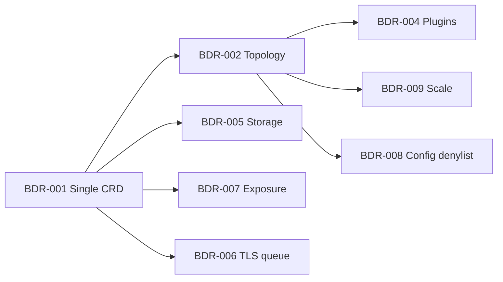

# Aggregation matrix (Helm → CRD)

Cross-field groups where **one BDR decision** governs multiple Helm paths.
Paths in a group **may be scattered** in `values.yaml` — join via `semantic-concerns.yaml`
and template evidence (`neo4j-config.yaml` for topology).

**Status**: Phase 3 complete — derived from [`_index.csv`](_index.csv) (93 rows) + Phase 2.5 semantic concerns.

**BDR-002 / BDR-004**: exemplars — amended per [`semantic-concern-report.md`](semantic-concern-report.md).

---

## Summary

| Group ID | Paths | versioning mix | BDR | Status |
|----------|------:|----------------|-----|--------|
| `AGG-TOPO-ROLES` | 10 | breaking | BDR-002, BDR-009 | BDR-002 proposed; BDR-009 proposed (scale) |
| `AGG-TOPO-PLUGINS` | 3 (+2 dual-tagged) | breaking / safe | BDR-004 | proposed |
| `AGG-STORAGE-DATA` | 9 | breaking | BDR-005 | proposed |
| `AGG-STORAGE-AUX` | 5 | safe | BDR-005 | proposed (shared mode pattern) |
| `AGG-EXPOSURE` | 11 | breaking / deferred | BDR-007 | proposed |
| `AGG-CONFIG-SURFACE` | 4 | breaking | BDR-008 | proposed |
| `AGG-TLS-TRUST` | 4 | breaking | BDR-006 | proposed |
| `AGG-SCHEDULING` | 15 | safe | — | iterable V1 — no dedicated BDR |
| `AGG-IMAGE` | 8 | safe | — | iterable |
| `AGG-AUTH` | 5 | safe / deferred | — | LDAP V2 deferred |
| `AGG-OBSERVABILITY` | 4 | safe | — | iterable |
| `AGG-HEALTH-PROBES` | 3 | safe | — | iterable |
| `none` | 10 | safe / deferred | — | packaging, escape hatches |

---

## Group detail

### `AGG-TOPO-ROLES` → BDR-002, BDR-009

**Coupling**: Cluster vs standalone, member counts, enable-server operations, edition gate, internals exposure — proven in `neo4j-config.yaml` + STS `replicas: 1`.

| helm_path | crd_target (draft) | versioning |
|-----------|-------------------|------------|
| `neo4j.name` | `Neo4j.metadata.name` | safe |
| `neo4j.edition` | `Neo4j.spec.edition` | breaking |
| `neo4j.minimumClusterSize` | `Neo4j.spec.topology.primaries.members` | breaking |
| `neo4j.operations` | Operator scale workflow | breaking |
| `neo4j.operations.enableServer` | Operator scale reconciliation | breaking |
| `neo4j.operations.image` | Operator Job image | deferred |
| `neo4j.operations.protocol` | Operator Job protocol | deferred |
| `neo4j.operations.ssl` | Operator Job TLS | deferred |
| `analytics` | `Neo4j.spec.topology.secondaries.analytics` | breaking |
| `analytics.type.name` | Pool assignment (`analytics` vs `primaries`) | breaking |

**Scale semantics** (ordinal order, tail-only resize) → **BDR-009** (may amend BDR-002 single-STS assumption).

---

### `AGG-TOPO-PLUGINS` → BDR-004

**Coupling**: APOC config/credentials + `env` plugin hooks tied to pool topology (GDS on `secondaries.analytics` only).

| helm_path | notes |
|-----------|-------|
| `apoc_config` | → `pluginDefinitions.apoc` |
| `apoc_credentials` | → `pluginDefinitions.apoc` secret refs |
| `env` | Generic env — partial overlap with plugins |

Dual-tagged with `AGG-TOPO-ROLES`: `analytics`, `analytics.type.name`.

---

### `AGG-STORAGE-DATA` + `AGG-STORAGE-AUX` → BDR-005

**Coupling**: `volumes.data.mode` is **immutable** after create; aux volumes (`backups`, `logs`, …) share the same mode vocabulary.

**Data (9)**:
`volumes.data`, `.mode`, `.labels`, `.disableSubPathExpr`, `.selector`, `.defaultStorageClass`, `.dynamic`, `.volume`, `.volumeClaimTemplate`

**Aux (5)**:
`volumes.backups`, `volumes.logs`, `volumes.metrics`, `volumes.import`, `volumes.licenses`

**Related (ungrouped)**: `additionalVolumes`, `additionalVolumeMounts`, `secretMounts` → `spec.persistence` escape hatches (safe).

---

### `AGG-EXPOSURE` → BDR-007

**Coupling**: Client Bolt/HTTP vs admin vs cluster-internal discovery; Helm multi-release shared LB vs operator single-STS.

| helm_path | crd_target (BDR-007 Option B) |
|-----------|------------------------------|
| `services.default` | `spec.connectivity.internal` |
| `services.neo4j` (+ enabled, spec.type, ports) | `spec.connectivity.external` |
| `services.admin` | `spec.connectivity.internal.admin` (operator-synthesized) |
| `services.internals` | `spec.connectivity.internal.discovery` |
| `services.neo4j.multiCluster` | `spec.connectivity.multiCluster` (deferred V1) |
| `services.neo4j.cleanup` | Finalizer / operator lifecycle |
| `clusterDomain` | `spec.connectivity.clusterDomain` |
| `podSpec.loadbalancer` | N/A — Helm per-release LB membership label |

---

### `AGG-CONFIG-SURFACE` → BDR-008

| helm_path | crd_target |
|-----------|------------|
| `config` | `Neo4j.spec.config` (map) |
| `jvm` | `Neo4j.spec.jvm` |
| `jvm.useNeo4jDefaultJvmArguments` | `Neo4j.spec.jvm.useNeo4jDefaults` |
| `jvm.additionalJvmArguments` | `Neo4j.spec.jvm.additionalArguments` |

**Reserved keys** (operator-injected): topology primaries count, SECONDARY mode — see BDR-002 / BDR-008 denylist.

---

### `AGG-TLS-TRUST` → BDR-006 (queue)

| helm_path | crd_target |
|-----------|------------|
| `ssl`, `ssl.bolt`, `ssl.https`, `ssl.cluster` | `Neo4j.spec.trust` |

Priority 12 (impact×freq) — document in register; dedicated BDR optional if BYO-secret contract needs locking before V1.

---

### Ungrouped (`none`) — no BDR

| helm_path | rationale |
|-----------|-----------|
| `nameOverride`, `fullnameOverride` | `metadata.name` / generateName — Helm-only |
| `disableLookups` | ArgoCD/Helm hook — operator N/A |
| `neo4j.offlineMaintenanceModeEnabled` | `spec.maintenance.offlineMode` — safe |
| `neo4j.resources` | `spec.resources` — safe |
| `additionalVolumes`, `additionalVolumeMounts`, `secretMounts` | persistence escape — safe |
| `securityContext`, `containerSecurityContext` | `spec.security` — safe |
| `podDisruptionBudget` | `spec.podDisruptionBudget` — safe |
| `statefulset.metadata` | `spec.scheduling` metadata — safe |

---

## Cross-group dependencies

---

## Discovered groups (none new in Phase 3)

No additional couplings beyond Phase 2 domain analysis. Scheduling (`AGG-SCHEDULING`, 15 paths) remains **iterable** without a blocking BDR — defaults mirror Helm `podSpec` / `nodeSelector`.
