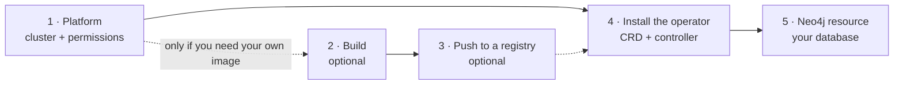

# Neo4j Kubernetes Operator — User Guide

Everything you need to install the operator, run Neo4j on Kubernetes, and operate it day to day.

This guide is self-contained: it links only to its own pages and to the runnable manifests under
[`examples/`](../../examples/). You never need to read the operator source or the design records
to use the product.

## Where to start

If you have never run the operator, follow **[Getting started](01-getting-started/readme.md)**.
It takes you from an empty cluster to a Neo4j instance answering queries, and it tells you what
the operator can and cannot do today.

If the operator is already running and you want to shape a deployment — clustering, storage,
TLS, plugins, metrics — go straight to the topic you need in **[Neo4j](03-neo4j/readme.md)**.

## The path, end to end

Five steps take you from an empty Kubernetes cluster to a database answering queries.



| Step | What you do | Page |
|------|-------------|------|
| 1. Platform | Provide a Kubernetes cluster, a StorageClass, and a context allowed to install a CRD and create RBAC | [Prerequisites](02-operator-installation/01-prerequisites.md) |
| 2. Build — *optional* | Compile the controller image from this repository | [Build the operator image](02-operator-installation/02-build-image.md) |
| 3. Push — *optional* | Put that image in a registry your cluster can pull from | [Build the operator image](02-operator-installation/02-build-image.md#make-the-image-reachable) |
| 4. Install the operator | Apply the CRD, then install the controller from the published chart or from a clone | [Operator installation](02-operator-installation/readme.md) |
| 5. Create a Neo4j | Apply a `Neo4j` resource; the operator builds the StatefulSet, Services and volumes | [Your first Neo4j](01-getting-started/first-neo4j.md) |

### Why steps 2 and 3 are optional

Every release publishes the controller image and the Helm chart to GHCR, publicly, so a normal
install pulls a ready image and never compiles anything. Go through the build and push steps only
when one of these is true.

**Build your own** when you changed the operator — a local fix, a patch you are testing — when you
need something that is merged but not released yet, or when your organisation requires that what
runs in production was compiled from sources it controls.

**Push to your own registry** when the cluster cannot reach GHCR, which covers air-gapped clusters
and any egress-filtered network, or when policy requires images to come from an internal registry
that scans and signs what it stores. Note that this reason does not imply the first one: you can
mirror the released image into your registry without building anything, which is often what
"we only pull from our own ACR" actually needs.

## Contents

| Section | What it covers |
|---------|----------------|
| [1. Getting started](01-getting-started/readme.md) | Platform walkthroughs, your first Neo4j, current feature status |
| [2. Operator installation](02-operator-installation/readme.md) | Installing from the published release or from source, watch scope, uninstalling |
| [3. Neo4j](03-neo4j/readme.md) | One page per concern: topology, storage, connectivity, security, configuration, plugins, monitoring, operations |
| [4. Troubleshooting](04-troubleshooting/01-common-issues.md) | Symptom-driven fixes, and how to read the operator log |
| [5. Reference](05-reference/api.md) | Complete `Neo4j` API reference, error catalog, operator-owned settings |
| [FAQ](faq.md) | Support scope, and which changes restart your pods |

## The two objects you work with

The operator and the databases it manages have separate lifecycles, and this guide is organised
along that split.

You install the **operator** once per cluster: a controller Deployment in its own namespace,
plus the `Neo4j` CustomResourceDefinition. It watches one namespace by default.

You then create one **`Neo4j` custom resource** per database deployment. The operator turns it
into StatefulSets, Services, ConfigMaps, Secrets and PersistentVolumeClaims, keeps them aligned
with the spec, and reports what it did through status conditions and Kubernetes Events.

```yaml
apiVersion: neo4j.com/v1beta1
kind: Neo4j
metadata:
  name: dev
spec:
  edition: enterprise
  version: "2026.05.0"
  license:
    accept: "yes"
  topology:
    mode: Standalone
  storage:
    volumes:
      data:
        mode: Dynamic
        dynamic:
          size: 10Gi
  auth:
    generatePassword: true
```

## Conventions used in this guide

Installing the operator needs no clone: the image, the chart and the CRD are published with every
release, as described in [Operator installation](02-operator-installation/readme.md). Commands that
do run from the repository root — anything using `make`, and the manifests under
[`examples/`](../../examples/) — say so. Namespaces are explicit in every `kubectl` command; where a
manifest omits `metadata.namespace`, the resource lands in `default`.

Field paths are written as you would type them in YAML, for example
`spec.storage.volumes.data.mode`. Every field mentioned in a topic page is listed with its type,
default and constraints in the [API reference](05-reference/api.md).
