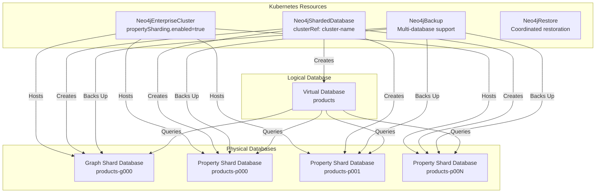
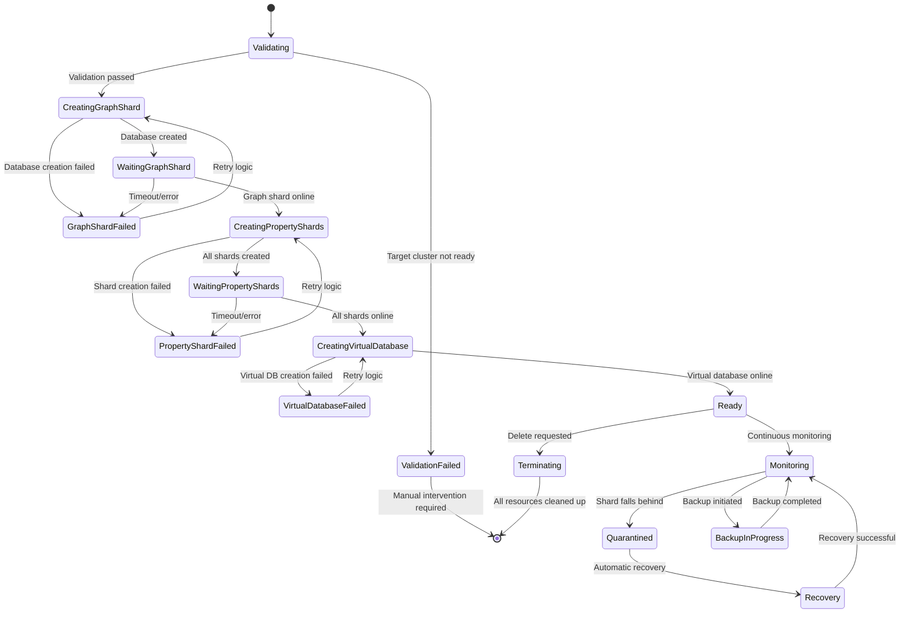

# Neo4j Property Sharding Implementation Analysis for Kubernetes Operator

**Date**: September 3, 2025
**Version**: 1.0
**Status**: Draft Analysis Report

## Executive Summary

Neo4j Property Sharding is a new distributed architecture feature that decouples node/relationship properties from the graph structure, storing them in separate "property shards" while maintaining the graph topology in a "graph shard". This analysis examines how to implement Property Sharding support in the Neo4j Kubernetes Operator.

**Key Findings:**
- Property Sharding requires Neo4j 2025.06+ and Cypher 25
- Introduces complex multi-database topology with graph shards and property shards
- Requires significant operator enhancements for topology management, backup coordination, and resource orchestration
- High implementation complexity due to distributed nature and advanced operational requirements

## 1. Property Sharding Architecture Overview

### 1.1 Core Concepts

Property Sharding separates Neo4j data into:

- **Graph Shard**: Single database containing nodes/relationships WITHOUT properties
- **Property Shards**: Multiple databases containing properties for nodes/relationships (distributed via hash function)
- **Virtual Database**: Logical database that presents unified view of graph + property shards

### 1.2 Complete System Architecture

```ascii
┌─────────────────────────────────────────────────────────────────────────────────┐
│                    Kubernetes Neo4j Operator Ecosystem                          │
│                                                                                 │
│  ┌─────────────────────┐    ┌─────────────────────┐    ┌─────────────────────┐  │
│  │                     │    │                     │    │                     │  │
│  │ Neo4jEnterpriseCluster   │ Neo4jShardedDatabase│    │    Neo4jBackup      │  │
│  │                     │    │                     │    │                     │  │
│  │ propertySharding:   │◄───│ clusterRef:         │───►│ databases:          │  │
│  │   enabled: true     │    │   "neo4j-cluster"   │    │   - products-g000   │  │
│  │   config:           │    │ databaseName:       │    │   - products-p000   │  │
│  │     internal.dbms...│    │   "products"        │    │   - products-p001   │  │
│  │                     │    │ propertyShards:     │    │                     │  │
│  │ topology:           │    │   count: 4          │    │                     │  │
│  │   servers: 5        │    │   replicas: 2       │    │                     │  │
│  │                     │    │                     │    │                     │  │
│  └─────────────────────┘    └─────────────────────┘    └─────────────────────┘  │
│            │                          │                          │              │
│            │                          │                          │              │
│            ▼                          ▼                          ▼              │
│  ┌────────────────────────────────────────────────────────────────────────────┐ │
│  │                        Physical Neo4j Cluster                              │ │
│  │                                                                            │ │
│  │    Server-0           Server-1           Server-2           Server-3       │ │
│  │ ┌─────────────┐   ┌─────────────┐   ┌─────────────┐   ┌─────────────┐      │ │
│  │ │Graph Shard  │   │Property     │   │Property     │   │Graph Shard  │      │ │
│  │ │products-g000│   │Shard        │   │Shard        │   │products-g000│      │ │
│  │ │(PRIMARY)    │   │products-p000│   │products-p001│   │(SECONDARY)  │      │ │
│  │ │             │   │(PRIMARY)    │   │(PRIMARY)    │   │             │      │ │
│  │ └─────────────┘   └─────────────┘   └─────────────┘   └─────────────┘      │ │
│  │ ┌─────────────┐   ┌─────────────┐   ┌─────────────┐   ┌─────────────┐      │ │
│  │ │Property     │   │Graph Shard  │   │Graph Shard  │   │Property     │      │ │
│  │ │Shard        │   │products-g000│   │products-g000│   │Shard        │      │ │
│  │ │products-p002│   │(SECONDARY)  │   │(SECONDARY)  │   │products-p003│      │ │
│  │ │(PRIMARY)    │   │             │   │             │   │(PRIMARY)    │      │ │
│  │ └─────────────┘   └─────────────┘   └─────────────┘   └─────────────┘      │ │
│  └────────────────────────────────────────────────────────────────────────────┘ │
│                                    │                                            │
│                                    ▼                                            │
│  ┌────────────────────────────────────────────────────────────────────────────┐ │
│  │                          Virtual Database                                  │ │
│  │                          "products"                                        │ │
│  │                                                                            │ │
│  │  Client Queries ──► Cypher 25 ──► Graph Structure + Properties ──► Results │ │
│  │                     Engine        (Unified View)                           │ │
│  └────────────────────────────────────────────────────────────────────────────┘ │
└─────────────────────────────────────────────────────────────────────────────────┘
```

### 1.3 CRD Relationship Model



### 1.4 Deployment Topology

- **Graph Shard**: Uses cluster's Raft consensus (3+ primaries recommended for HA)
- **Property Shards**: Use cluster's replica-based replication (M = F + 1 fault tolerance)
- **Servers**: Host multiple shards based on cluster capacity and resource allocation
- **Virtual Database**: Logical construct managed by Neo4j query engine

## 2. Complete Lifecycle Management

### 2.1 Property Sharding Lifecycle States

```ascii
┌─────────────────────────────────────────────────────────────────────────────────┐
│                    Neo4jShardedDatabase Lifecycle                               │
└─────────────────────────────────────────────────────────────────────────────────┘

Phase: Initializing
┌─────────────────┐    ┌─────────────────┐    ┌─────────────────┐
│   1. Validate   │───►│  2. Create      │───►│  3. Wait for    │
│  Target Cluster │    │ Graph Shard DB  │    │  Graph Online   │
└─────────────────┘    └─────────────────┘    └─────────────────┘
        │                       │                       │
        │ Checks:              │ CREATE DATABASE       │ Status:
        │ - Cluster ready      │ products-g000         │ SHOW DATABASES
        │ - Sharding enabled   │ TOPOLOGY 3 PRIMARIES  │ products-g000 = ONLINE
        │ - Version >=2025.06  │ 2 SECONDARIES WAIT    │
        │                      │                       │
        ▼                       ▼                       ▼

Phase: Creating Property Shards
┌─────────────────┐    ┌─────────────────┐    ┌─────────────────┐
│  4. Create      │───►│  5. Create      │───►│  6. Wait for    │
│ Property Shard 0│    │ Property Shard N│    │  All Shards     │
└─────────────────┘    └─────────────────┘    └─────────────────┘
        │                       │                       │
        │ CREATE DATABASE       │ CREATE DATABASE       │ Status:
        │ products-p000         │ products-p00N         │ All shards
        │ TOPOLOGY 2 PRIMARIES  │ TOPOLOGY 2 PRIMARIES  │ status = ONLINE
        │ WAIT                  │ WAIT                  │
        │                       │                       │
        ▼                       ▼                       ▼

Phase: Creating Virtual Database
┌─────────────────┐    ┌─────────────────┐    ┌─────────────────┐
│  7. Create      │───►│  8. Validate    │───►│   9. Ready      │
│ Virtual Database│    │ Virtual Database│    │    State        │
└─────────────────┘    └─────────────────┘    └─────────────────┘
        │                       │                      │
        │ CREATE SHARDED        │ SHOW SHARDED         │ Phase: Ready
        │ DATABASE products     │ DATABASES            │ All shards
        │ GRAPH SHARD...        │ Status: Online       │ operational
        │ PROPERTY SHARDS...    │                      │
        │                       │                      │
        ▼                       ▼                      ▼

┌─────────────────────────────────────────────────────────────────────────────────┐
│                           Operational State                                     │
│                                                                                 │
│  - Continuous health monitoring of all shard databases                          │
│  - Transaction log position synchronization monitoring                          │
│  - Automatic quarantine detection and recovery                                  │
│  - Cross-shard backup coordination                                              │
│  - Virtual database query routing optimization                                  │
└─────────────────────────────────────────────────────────────────────────────────┘
```

### 2.2 Controller State Machine



### 2.3 Integration with Existing CRDs

```ascii
┌─────────────────────────────────────────────────────────────────────────────────┐
│                        CRD Integration Architecture                             │
└─────────────────────────────────────────────────────────────────────────────────┘

┌─────────────────────┐
│ Neo4jEnterpriseCluster    PHASE 1: Cluster Preparation
│ Controller          │ ═════════════════════════════════════════
│                     │ 1. Validates image version >= 2025.06
│ Responsibilities:   │ 2. Applies property sharding config
│ • Version validation│ 3. Restarts cluster with new settings
│ • Config management │ 4. Validates sharding readiness
│ • Resource scaling  │ 5. Updates status.propertyShardingReady
└─────────────────────┘
           │
           │ Cluster ready for sharding
           ▼
┌─────────────────────┐
│ Neo4jShardedDatabase     PHASE 2: Database Creation
│ Controller          │ ═════════════════════════════════════════
│                     │ 1. Validates target cluster
│ Responsibilities:   │ 2. Creates graph shard database
│ • Database creation │ 3. Creates property shard databases
│ • Lifecycle mgmt    │ 4. Creates virtual database
│ • Health monitoring │ 5. Monitors shard synchronization
│ • Status reporting  │ 6. Handles recovery scenarios
└─────────────────────┘
           │
           │ Sharded database operational
           ▼
┌────────────────────┐
│ Neo4jBackup        │     PHASE 3: Operational Management
│ Controller         │ ═════════════════════════════════════════
│                    │ 1. Coordinates multi-database backups
│ Enhanced Features: │ 2. Ensures consistency across shards
│ • Multi-DB backup  │ 3. Validates backup integrity
│ • Consistency mgmt │ 4. Manages retention policies
│ • Restore coord    │ 5. Handles partial restore scenarios
└────────────────────┘
           │
           │ Backup/restore operations
           ▼
┌────────────────────┐
│ Neo4jRestore       │     PHASE 4: Disaster Recovery
│ Controller         │ ═════════════════════════════════════════
│                    │ 1. Coordinates multi-database restore
│ Enhanced Features: │ 2. Manages restore sequencing
│ • Multi-DB restore │ 3. Validates data consistency
│ • Sequencing logic │ 4. Rebuilds virtual database
│ • Consistency check│ 5. Verifies operational readiness
└────────────────────┘
```

## 3. Kubernetes Operator Implementation Requirements

### 3.1 Enhanced Neo4jEnterpriseCluster CRD

First, the existing `Neo4jEnterpriseCluster` CRD must be enhanced to support Property Sharding configuration:

```yaml
apiVersion: neo4j.neo4j.com/v1alpha1
kind: Neo4jEnterpriseCluster
metadata:
  name: neo4j-cluster
  namespace: default
spec:
  # Existing cluster configuration...
  topology:
    servers: 5  # Enough servers to host graph + property shards

  # NEW: Property Sharding Support Configuration
  propertySharding:
    enabled: true  # Enable property sharding support on this cluster

    # Required configuration for property sharding
    config:
      internal.dbms.sharded_property_database.enabled: "true"
      db.query.default_language: "CYPHER_25"
      internal.dbms.cluster.experimental_protocol_version.dbms_enabled: "true"
      internal.dbms.sharded_property_database.allow_external_shard_access: "false"

      # Transaction log retention (critical for property shard sync)
      db.tx_log.rotation.retention_policy: "7 days"
      internal.dbms.sharded_property_database.property_pull_interval: "10ms"

  # Enhanced resource configuration for sharding workloads
  resources:
    requests:
      memory: "4Gi"  # Higher memory for shard coordination
      cpu: "1000m"
    limits:
      memory: "8Gi"
      cpu: "2000m"

  # Ensure Neo4j 2025.06+ for property sharding
  image:
    repo: "neo4j"
    tag: "2025.06-enterprise"  # Minimum version required

status:
  # Existing status fields...

  # NEW: Property sharding readiness
  propertyShardingReady: true  # Indicates cluster is ready for sharded databases
```

### 2.2 Neo4jShardedDatabase CRD Design

The `Neo4jShardedDatabase` CRD targets an existing `Neo4jEnterpriseCluster`:

```yaml
apiVersion: neo4j.neo4j.com/v1alpha1
kind: Neo4jShardedDatabase
metadata:
  name: my-sharded-db
  namespace: default
spec:
  # Target existing Neo4j cluster (REQUIRED)
  clusterRef: "neo4j-cluster"  # References existing Neo4jEnterpriseCluster

  # Sharded database configuration
  databaseName: "products"  # Name of the virtual sharded database
  cypherVersion: "25"       # Required for Property Sharding

  # Property Shards Configuration
  propertyShards:
    count: 4              # Number of property shards to create
    replicas: 2           # Replicas per property shard (for fault tolerance)

  # Graph Shard Configuration
  graphShard:
    topology:
      primaries: 3        # Override default cluster topology for graph shard only
      secondaries: 2

  # Optional: Seeding configuration
  seedConfiguration:
    seedURI: "s3://bucket/backups/"
    seedSourceDatabase: "source-db"

status:
  phase: "Ready" | "Initializing" | "Failed" | "Mixed"
  message: "Sharded database status"

  # Graph shard status (references cluster database)
  graphShard:
    name: "my-sharded-db-g000"
    cluster: "neo4j-cluster"
    phase: "Ready"
    ready: true

  # Property shard status
  propertyShards:
  - name: "my-sharded-db-p000"
    index: 0
    cluster: "neo4j-cluster"
    phase: "Ready"
    replicas: 2
    ready: true
  - name: "my-sharded-db-p001"
    index: 1
    cluster: "neo4j-cluster"
    phase: "Ready"
    replicas: 2
    ready: true

  conditions:
  - type: "Ready"
    status: "True"
    reason: "AllShardsOnline"
    message: "All shards are healthy on target cluster"
```

### 2.2 Resource Management Strategy

The operator targets existing `Neo4jEnterpriseCluster` instances for shard hosting:

**Resource Targeting Pattern:**
1. **Target Cluster**: Reference existing `Neo4jEnterpriseCluster` that supports property sharding
2. **Graph Shard**: Create database `{sharded-db-name}-g000` on target cluster
3. **Property Shards**: Create databases `{sharded-db-name}-p000`, `{sharded-db-name}-p001`, etc. on target cluster
4. **Virtual Database**: Create logical database that combines shards
5. **Client Access**: Provide unified service endpoint for virtual database access

### 2.3 Controller Implementation Design

```go
type Neo4jShardedDatabaseReconciler struct {
    client.Client
    Scheme   *runtime.Scheme
    Recorder record.EventRecorder
}

// Key reconciliation responsibilities:
func (r *Neo4jShardedDatabaseReconciler) Reconcile(ctx context.Context, req ctrl.Request) (ctrl.Result, error) {
    // 1. Validate target cluster supports property sharding
    // 2. Verify cluster has propertySharding.enabled = true
    // 3. Create graph shard database on target cluster
    // 4. Create property shard databases on target cluster
    // 5. Coordinate database creation sequence
    // 6. Monitor shard health and synchronization
    // 7. Create virtual database representation
    // 8. Update status with shard information
}

// New validation for targeting existing clusters:
func (r *Neo4jShardedDatabaseReconciler) validateTargetCluster(ctx context.Context, clusterRef string, namespace string) error {
    var cluster neo4jv1alpha1.Neo4jEnterpriseCluster
    err := r.Get(ctx, types.NamespacedName{Name: clusterRef, Namespace: namespace}, &cluster)
    if err != nil {
        return fmt.Errorf("target cluster %s not found: %w", clusterRef, err)
    }

    // Verify cluster supports property sharding
    if cluster.Spec.PropertySharding == nil || !cluster.Spec.PropertySharding.Enabled {
        return fmt.Errorf("target cluster %s does not have property sharding enabled", clusterRef)
    }

    // Verify cluster is ready
    if cluster.Status.Phase != "Ready" {
        return fmt.Errorf("target cluster %s is not ready (current phase: %s)", clusterRef, cluster.Status.Phase)
    }

    return nil
}
```

## 3. Technical Implementation Challenges

### 3.1 Virtual Database Creation Process

**Critical Missing Detail: Virtual Database Implementation**
```cypher
-- Step 1: Create individual shard databases
CREATE DATABASE `products-g000` TOPOLOGY 3 PRIMARIES 2 SECONDARIES WAIT;
CREATE DATABASE `products-p000` TOPOLOGY 2 PRIMARIES WAIT;
CREATE DATABASE `products-p001` TOPOLOGY 2 PRIMARIES WAIT;

-- Step 2: Create virtual database combining shards (Neo4j 2025.06+ syntax)
CREATE SHARDED DATABASE products
GRAPH SHARD `products-g000`
PROPERTY SHARDS `products-p000`, `products-p001`;
```

**Controller Implementation Requirements:**
1. **Database Creation Order**: Graph shard must be created and online before property shards
2. **Naming Convention**: Consistent naming pattern for shard identification
3. **Status Monitoring**: Monitor each individual database status via `SHOW DATABASES`
4. **Virtual Database Validation**: Verify virtual database creation via `SHOW SHARDED DATABASES`

### 3.2 RBAC and Permission Requirements

**Critical Missing Detail: Enhanced RBAC**
The operator requires additional RBAC permissions for property sharding:

```yaml
# Additional ClusterRole permissions needed:
rules:
- apiGroups: ["neo4j.com"]
  resources: ["neo4jshareddatabases"]
  verbs: ["get", "list", "watch", "create", "update", "patch", "delete"]
- apiGroups: ["neo4j.com"]
  resources: ["neo4jshareddatabases/status"]
  verbs: ["get", "update", "patch"]
- apiGroups: ["neo4j.com"]
  resources: ["neo4jshareddatabases/finalizers"]
  verbs: ["update"]
```

### 3.3 Configuration Complexity

**Required Configuration Settings:**
```yaml
config:
  # Core Property Sharding Settings
  internal.dbms.sharded_property_database.enabled: "true"
  db.query.default_language: "CYPHER_25"
  internal.dbms.cluster.experimental_protocol_version.dbms_enabled: "true"

  # Transaction Log Management (Critical)
  db.tx_log.rotation.retention_policy: "7 days" # Must cover backup intervals
  internal.dbms.sharded_property_database.property_pull_interval: "10ms"

  # Performance Optimization
  server.memory.heap.max_size: "8G" # Larger heaps for shard coordination
  server.memory.pagecache.size: "4G" # Adequate page cache
```

### 3.2 Database Creation Orchestration

**Sequential Database Creation Requirements:**
1. Validate target cluster supports property sharding and is ready
2. Create graph shard database on target cluster (uses cluster's Raft consensus)
3. Wait for graph shard database to reach `ONLINE` state
4. Create property shard databases on target cluster (uses cluster's replication)
5. Coordinate shard database registration and discovery
6. Create virtual database combining all shards

### 3.3 Backup and Recovery Integration

**Multi-Shard Backup Integration:**
Property sharding backup coordination leverages existing cluster backup infrastructure:

```yaml
# Backup coordination approach:
# 1. Extend existing Neo4jBackup CRD to support multi-database backups
# 2. Coordinate backup timing across all shard databases
# 3. Leverage existing cluster backup StatefulSet for execution
# 4. Ensure consistent backup points across all shards

# Enhanced Neo4jBackup for sharded databases:
apiVersion: neo4j.com/v1alpha1
kind: Neo4jBackup
metadata:
  name: sharded-db-backup
spec:
  clusterRef: "neo4j-cluster"  # Target cluster with property sharding

  # Multi-database backup specification
  databases:
    - name: "products-g000"      # Graph shard
      type: "full+differential"
    - name: "products-p000"      # Property shards (full backups only)
      type: "full"
    - name: "products-p001"
      type: "full"

  schedule: "0 2 * * *"
  consistency: "cross-database"  # Ensure consistent backup point
```

### 3.4 Health Monitoring and Split-Brain Detection

**Enhanced Monitoring Requirements:**
- Monitor transaction log synchronization between graph and property shards
- Detect property shards falling behind transaction log range
- Handle shard quarantine/recovery procedures
- Coordinate cross-shard consistency checks

## 4. Operational Considerations

### 4.1 Cluster Capacity Planning

**Property Sharding Resource Impact:**
Since sharded databases run on existing clusters, capacity planning becomes critical:

- **Additional CPU**: 20-30% increase per server for shard coordination overhead
- **Additional Memory**: 2-4GB extra heap space per server for cross-shard operations
- **Storage Growth**: Depends on property distribution across shards
- **Network**: Increased inter-server traffic for transaction log replication
- **Backup Storage**: Linear increase with number of property shards

**Cluster Sizing Recommendations:**
- **Minimum Cluster Size**: 5 servers for hosting graph + property shards with redundancy
- **Memory per Server**: 12GB+ heap (up from typical 8GB) for shard coordination
- **CPU per Server**: 2+ cores per server (up from typical 1 core) for cross-shard queries
- **Network**: Low-latency networking essential for transaction log sync

### 4.2 High Availability Design

**Fault Tolerance Calculations:**
- **Graph Shard**: Minimum 3 primaries (tolerates 1 failure)
- **Property Shards**: M = F + 1 replicas (2 replicas = 1 failure tolerance)
- **Network Partitions**: Requires majority consensus for graph shard operations

### 4.3 Scaling and Performance

**Scaling Considerations:**
- **No Dynamic Resharding**: Property shard count is fixed at creation
- **Over-provisioning Strategy**: Start with more shards than needed
- **Server Distribution**: Distribute shards across multiple Kubernetes nodes
- **Performance Tuning**: Adjust property pull intervals and transaction log retention

## 5. Implementation Roadmap

### 5.1 Phase 1: Foundation

**Deliverables:**
- [ ] Enhanced `Neo4jEnterpriseCluster` CRD with property sharding support
- [ ] New `Neo4jShardedDatabase` CRD definition for targeting existing clusters
- [ ] Basic controller scaffold with cluster targeting validation
- [ ] Unit test framework

**Key Tasks:**
1. Enhance Neo4jEnterpriseCluster CRD with propertySharding configuration
2. Design Neo4jShardedDatabase CRD with clusterRef targeting
3. Create controller boilerplate with proper RBAC for cluster targeting
4. Implement cluster validation logic (property sharding enabled, ready status)

### 5.2 Phase 2: Core Implementation

**Deliverables:**
- [ ] Database creation on target clusters (graph and property shards)
- [ ] Shard coordination and sequencing logic
- [ ] Virtual database management
- [ ] Basic health monitoring and status reporting

**Key Tasks:**
1. Implement database creation using Neo4j client on target clusters
2. Create shard coordination logic (graph shard first, then property shards)
3. Implement virtual database lifecycle management
4. Build comprehensive status reporting for multi-shard databases

### 5.3 Phase 3: Advanced Features

**Deliverables:**
- [ ] Multi-shard backup coordination
- [ ] Disaster recovery procedures
- [ ] Advanced monitoring and alerting
- [ ] Performance optimization features

**Key Tasks:**
1. Implement coordinated backup strategies across shards
2. Create shard recovery and quarantine procedures
3. Add comprehensive monitoring and metrics
4. Implement performance tuning capabilities

### 5.4 Phase 4: Testing and Hardening

**Deliverables:**
- [ ] Comprehensive integration test suite
- [ ] Chaos engineering test scenarios
- [ ] Performance benchmarking
- [ ] Documentation and examples

**Key Tasks:**
1. Create integration tests for all sharding scenarios
2. Implement chaos testing for failure scenarios
3. Performance testing and optimization
4. Complete documentation and user guides

## 6. Risk Assessment

### 6.1 High Risk Areas

**Technical Risks:**
- **Transaction Log Coordination**: CRITICAL - Property shards must stay within transaction log range of graph shard
  - Risk: Property shard falls behind → automatic quarantine → data unavailability
  - Mitigation: Robust transaction log retention configuration (7+ days minimum)
  - Monitoring: Continuous transaction log position monitoring across all shards
- **Multi-Database State Management**: Complex state machines for coordinating 4+ databases simultaneously
- **Cross-Shard Query Performance**: Virtual database queries may experience significant latency
- **Backup Chain Validation**: Multi-shard backup consistency verification is complex and error-prone
- **Version Skew**: Incompatible Neo4j versions between operator and cluster can cause feature failures

**Operational Risks:**
- **Resource Capacity Planning**: Property sharding can consume 2-3x normal cluster resources
- **Split-Brain Scenarios**: Multiple independent databases increase split-brain risk surface
- **Recovery Complexity**: Restoring sharded databases requires coordinated multi-database restoration
- **Configuration Drift**: Property sharding configurations are numerous and interdependent
- **Skill Requirements**: Operations teams need deep Neo4j property sharding expertise

### 6.2 Mitigation Strategies

1. **Phased Implementation**: Implement in phases with extensive testing
2. **Comprehensive Testing**: Include chaos engineering and failure scenario testing
3. **Clear Documentation**: Extensive operational documentation and troubleshooting guides
4. **Resource Management**: Implement resource quotas and monitoring
5. **Expert Review**: Engage Neo4j engineering for architecture review

## 6.5. Operational Monitoring and Observability

### 6.5.1 Multi-Shard Monitoring Architecture

```ascii
┌─────────────────────────────────────────────────────────────────────────────────┐
│                      Property Sharding Monitoring Stack                         │
└─────────────────────────────────────────────────────────────────────────────────┘

┌────────────────────────────────────────────────────────────────────────────────┐
│                            Alerting Layer                                      │
│                                                                                │
│  ┌─────────────────┐  ┌──────────────────┐  ┌─────────────────┐                │
│  │ Shard Lag Alert │  │Split-Brain Alert │  │ Backup Failure  │                │
│  │ > 5min behind   │  │Multiple primaries│  │ Cross-shard     │                │
│  │ txlog position  │  │ detected         │  │ inconsistency   │                │
│  └─────────────────┘  └──────────────────┘  └─────────────────┘                │
└────────────────────────────────────────────────────────────────────────────────┘
                                    │
                                    ▼
┌────────────────────────────────────────────────────────────────────────────────┐
│                           Metrics Collection                                   │
│                                                                                │
│  ┌─────────────────────────────────────────────────────────────────────────┐   │
│  │                        Prometheus Metrics                               │   │
│  │                                                                         │   │
│  │ • neo4j_sharded_database_status{db="products", shard="g000"}            │   │
│  │ • neo4j_shard_txlog_position{shard="g000", server="server-0"}           │   │
│  │ • neo4j_shard_lag_seconds{graph_shard="g000", property_shard="p000"}    │   │
│  │ • neo4j_virtual_database_query_duration{db="products"}                  │   │
│  │ • neo4j_shard_backup_success{shard="g000", backup_type="full"}          │   │
│  │ • neo4j_shard_recovery_time{shard="p001", recovery_type="quarantine"}   │   │
│  └─────────────────────────────────────────────────────────────────────────┘   │
└────────────────────────────────────────────────────────────────────────────────┘
                                    │
                                    ▼
┌────────────────────────────────────────────────────────────────────────────────┐
│                         Data Collection Sources                                │
│                                                                                │
│  ┌─────────────────┐  ┌─────────────────┐  ┌─────────────────┐                 │
│  │Neo4j Sharded DB │  │    Operator     │  │  Backup System  │                 │
│  │   Controller    │  │   Health Checks │  │   Status API    │                 │
│  │                 │  │                 │  │                 │                 │
│  │• Database status│  │• Cluster status │  │• Backup progress│                 │
│  │• Query metrics  │  │• Resource usage │  │• Consistency    │                 │
│  │• Shard topology │  │• Error rates    │  │  validation     │                 │
│  └─────────────────┘  └─────────────────┘  └─────────────────┘                 │
└────────────────────────────────────────────────────────────────────────────────┘
```

### 6.5.2 Critical Monitoring Queries

**Transaction Log Synchronization Monitoring:**
```promql
# Detect property shards falling behind graph shard
neo4j_shard_lag_seconds > 300

# Monitor transaction log position differences
(
  max(neo4j_shard_txlog_position{shard=~".*-g000"}) -
  min(neo4j_shard_txlog_position{shard=~".*-p[0-9]+"})
) > 1000
```

**Virtual Database Performance Monitoring:**
```promql
# Query performance degradation
increase(neo4j_virtual_database_query_duration[5m]) > 0.5

# Cross-shard query latency
histogram_quantile(0.95,
  neo4j_query_execution_time_bucket{query_type="cross_shard"}
) > 2.0
```

**Shard Health Monitoring:**
```promql
# Database availability
neo4j_sharded_database_status != 1

# Backup success rate
rate(neo4j_shard_backup_success[1h]) < 0.95
```

### 6.5.3 Grafana Dashboard Layout

```ascii
┌─────────────────────────────────────────────────────────────────────────────────┐
│                      Property Sharding Operations Dashboard                     │
└─────────────────────────────────────────────────────────────────────────────────┘

┌────────────────────┐ ┌────────────────────┐ ┌────────────────────┐
│    Shard Status    │ │  Transaction Log   │ │   Query Performance│
│                    │ │    Synchronization │ │                    │
│ ● G000: ONLINE     │ │ Graph:  12:34:45   │ │ Avg: 234ms         │
│ ● P000: ONLINE     │ │ P000:   12:34:43   │ │ P95: 1.2s          │
│ ● P001: ONLINE     │ │ P001:   12:34:44   │ │ P99: 2.8s          │
│ ● P002: ONLINE     │ │ Lag:    <2s ✓      │ │ Errors: 0.1%       │
└────────────────────┘ └────────────────────┘ └────────────────────┘

┌────────────────────┐ ┌────────────────────┐ ┌────────────────────┐
│  Backup Status     │ │  Resource Usage    │ │    Alert Status    │
│                    │ │                    │ │                    │
│ Last Full: 2h ago  │ │ CPU: 65%           │ │ ⚠️  Shard P002 Lag │
│ Last Diff: 15m ago │ │ Memory: 72%        │ │ ✅ All Others OK   │
│ Success Rate: 98%  │ │ Storage: 45%       │ │ 🔄 Recovery Active │
│ Next: in 45m       │ │ Network: 23MB/s    │ │                    │
└────────────────────┘ └────────────────────┘ └────────────────────┘

┌─────────────────────────────────────────────────────────────────────────────────┐
│                        Historical Trends (24h)                                  │
│                                                                                 │
│  Transaction Log Positions ──────────────────────────────────────────────────── │
│  Query Response Times     ────────────────────────────────────────────────────  │
│  Backup Success Rates     ────────────────────────────────────────────────────  │
│  Resource Utilization     ────────────────────────────────────────────────────  │
└─────────────────────────────────────────────────────────────────────────────────┘
```

### 6.5.4 Integration with Existing Monitoring

**Extends Existing Neo4j Operator Monitoring:**

1. **Cluster Monitoring**: Existing cluster health checks extend to multi-database scenarios
2. **Pod Monitoring**: Existing pod metrics include shard-specific labels
3. **Service Monitoring**: Client service metrics include virtual database routing
4. **Backup Monitoring**: Existing backup metrics extend to multi-shard coordination
5. **Alert Integration**: Property sharding alerts integrate with existing AlertManager rules

**New Monitoring Components Required:**

- **ShardedDatabase Controller Metrics**: Status, reconciliation frequency, error rates
- **Cross-Shard Query Metrics**: Virtual database query patterns and performance
- **Transaction Log Metrics**: Position tracking, lag detection, sync status
- **Multi-Database Backup Metrics**: Coordination status, consistency validation

## 7. Compatibility and Prerequisites

### 7.1 Version Requirements and Validation

**Neo4j Version:**
- **Minimum**: Neo4j 2025.06.0-enterprise (first version with property sharding support)
- **Recommended**: Neo4j 2025.08.0+ (includes improved seed URI syntax and stability fixes)

**Critical Implementation Detail: Version Validation**
```go
// Controller must validate Neo4j version before enabling property sharding
func (r *Neo4jEnterpriseClusterReconciler) validatePropertyShardingSupport(cluster *neo4jv1alpha1.Neo4jEnterpriseCluster) error {
    imageTag := cluster.Spec.Image.Tag

    // Parse version from tag (supports both semver and calver)
    version, err := parseNeo4jVersion(imageTag)
    if err != nil {
        return fmt.Errorf("invalid Neo4j version: %w", err)
    }

    // Check minimum version requirement
    minVersion := semver.MustParse("2025.06.0")
    if version.LT(minVersion) {
        return fmt.Errorf("property sharding requires Neo4j 2025.06.0+, got %s", version)
    }

    return nil
}
```

**Version Migration Strategy:**
- **Cluster Upgrade**: Property sharding can only be enabled AFTER upgrading to 2025.06+
- **Backwards Compatibility**: Clusters without property sharding remain unaffected
- **Feature Flag**: Property sharding should be gated behind feature flag in initial releases

**Kubernetes Requirements:**
- **Minimum**: Kubernetes 1.24+ (for Kubebuilder v4 compatibility)
- **Storage**: CSI driver supporting ReadWriteMany for shared configurations
- **Network**: Low-latency networking between nodes hosting shards
- **Memory**: Increased memory limits for cluster nodes (12GB+ heap recommended)

### 7.2 Feature Dependencies

**Operator Features:**
- Existing cluster management (for graph shards)
- Backup and restore capabilities
- TLS certificate management (cert-manager integration)
- Resource monitoring and metrics

## 8. Recommendations

### 8.1 Implementation Priority

**Recommended Approach:**
1. **Start with Phase 1** to establish foundation and validate approach
2. **Focus on operational simplicity** in initial implementation
3. **Implement comprehensive testing** before production readiness
4. **Consider feature flag** to enable/disable sharded database support

### 8.2 Resource Investment

**Development Requirements:**
- **Comprehensive Testing**: Include integration and chaos engineering scenarios
- **Documentation**: Complete user guides and operational documentation
- **Expert Knowledge**: Requires deep Neo4j and Kubernetes expertise

### 8.3 Success Criteria

**Phase 1 Success Metrics:**
- [ ] Enhanced Neo4jEnterpriseCluster CRD accepts property sharding configuration
- [ ] Neo4jShardedDatabase CRD validates with cluster targeting
- [ ] Controller successfully validates target cluster readiness
- [ ] Unit test coverage >80%

**Phase 2 Success Metrics:**
- [ ] End-to-end sharded database creation on target clusters works
- [ ] All shards created successfully on existing cluster
- [ ] Basic CRUD operations work through virtual database
- [ ] Integration test suite passes with cluster targeting

**Production Readiness Criteria:**
- [ ] Comprehensive backup and recovery procedures work
- [ ] Disaster recovery scenarios tested and documented
- [ ] Performance meets baseline requirements
- [ ] Complete operational documentation available

## 9. Conclusion

Neo4j Property Sharding represents a significant architectural advancement that requires substantial operator enhancements. The revised implementation approach using existing cluster targeting reduces complexity while maintaining powerful capabilities for scaling property-heavy workloads.

**Key Recommendations:**
1. **Proceed with revised architecture**: Targeting existing clusters reduces implementation complexity
2. **Phase implementation**: Start with cluster enhancement and build incrementally
3. **Focus on reliability**: Prioritize operational stability over feature completeness
4. **Extensive testing**: Include failure scenarios and chaos engineering
5. **Expert consultation**: Engage Neo4j engineering for architecture guidance

**Architecture Benefits:**
- **Reduced Complexity**: Simplified resource management through cluster targeting approach
- **Resource Efficiency**: Leverages existing cluster infrastructure instead of creating new clusters
- **Operational Simplicity**: Familiar cluster management patterns for operators
- **Lower Risk**: Building on proven cluster targeting patterns reduces implementation risk

## 10. Next Steps

1. Review and validate this analysis with Neo4j engineering team
2. Create detailed technical design document for Phase 1
3. Establish development environment and resource allocation
4. Begin CRD design and initial controller implementation
